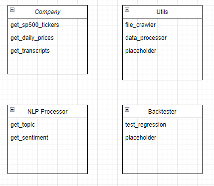

# CorpEarningCallNLP

Apply information extraction and sentiment analysis on public companies earning calls

## work in progress
* Tentatively thinking the classes for this project as below. 
Drawing is done through draw.io (file in github as well)

# 1.	project flow: 
 
# 2. key entities/process:
## 2.1 S&P 500: 
### 2.1.1 all tickers – webscrape through Wikipedia
This step is done as a function. (Eric)
### 2.1.2 company earnings call transcripts
The current source is through factset. (Maud is working on it).
But for now, I have downloaded a pdf file into the data folder so the functions can be developed and tested against this one file. And Eric is writing a pdf reader function. 
### 2.1.2 company stock price 
We can start with daily and may be move to minutes level as needed since we only need the price data around the earning days. 
## 2.2 NLP processor
### 2.2.1 key context extraction 
### 2.2.2 sentiment analysis on the sentence(s) around the key context 
## 2.3 Regression backtestor 
### 2.3.1 regress the stock price against the sentiment analysis around the topic. The theory is that if the sentiment is correct, then we should see the stock price going in the same direction as the sentiment. 
